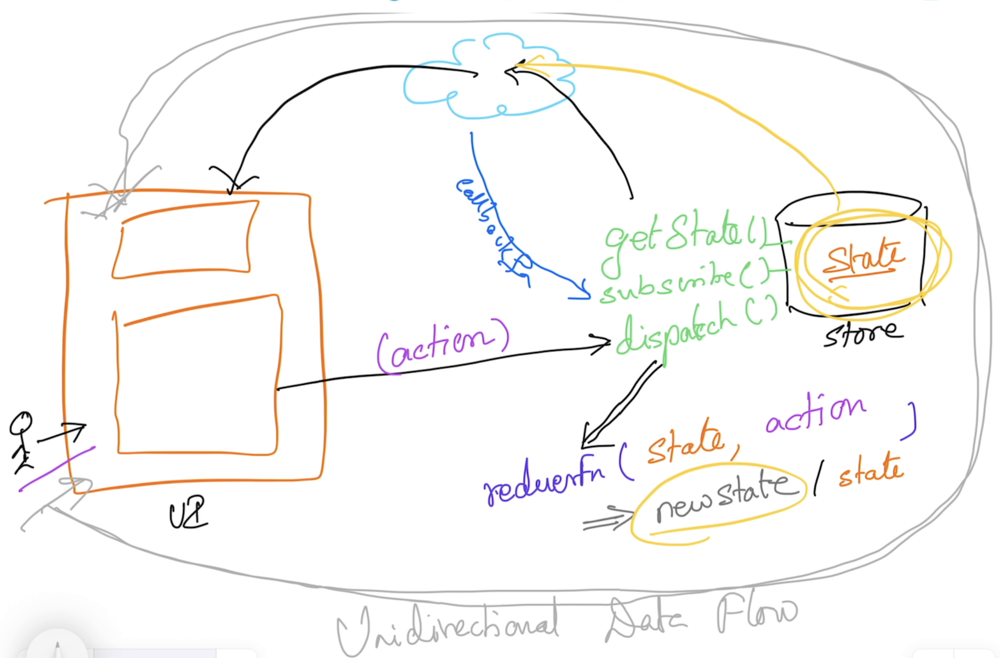

# Web Development using React & Redux

## Magesh Kuppan
- tkmagesh77@gmail.com

## Schedule
Session-1   : 11:00 AM to 01:00 PM
Session-2   : 02:00 PM to 03:30 PM
Session-3   : 03:45 PM to 05:00 PM

## Methodology
- No powerpoint
- Discuss & Code
- Anytime Q & A

## Software Requirement
- Chrome Browser
- Any Editor (VSCode)
- Node.js 

## Repository
- https://github.com/tkmagesh/deshaw-react-aug-2025

## References
- Domain Driven Design - Eric Evans
- Patterns of Enterprise Application Architecture - Martin Fowler
- Agile Principles Patterns and Practices - Robert. C. Martin
- Growing Object Oriented Oriented Software Guided By Tests - Freeman Steve


## What is React?
- JS library for building UI
- Specialized for building SPA

## SOLID Principles
- S -> Single Responsibility Principle (SRP) [*]
- O -> Open Closed Principle (OCP) [*] 
- L -> Liskov's Substitution Principle (LSP)
- I -> Interface Segregation Principle (ISP)
- D -> Dependency Inversion Principle (DIP) [*]

## React
- Helps in creating Views (Components)
- Component 
    - Encapsulates Presentation + UI Logic + State
    - Rerender the whole presentation when the `state` is changing
- Uses VDOM to optimize the rendering of the UI

### JSX
| HTML | JSX |
| ---- | ---- |
| Can have tags without the corresponding close tags | Every tag must have the corresponding close tag |
| Can use `class` attribute | Use `className` instead of `class` |
| Can use `for` attribute | Use `htmlFor` instead of `for` |

### State Categories
#### UI State
- Data that primarily deals with the UI needs of the application
- It is very unlikely that a change in this state need to be reflected in other parts of the application
- advisable to maintain this in the component state (React.useState())

#### Domain/App State
- Data that primarily deals with the 'domain' logic of the application
- It is HIGHLY likely that a change in this data need to be reflected in other parts of the application
- advisable to maintain this outside the component hierarchy

## State Management
### Store
- In-memory object that encapsulate ALL of the 'application/domain state' outside the component hierarchy
- ONLY one `store` instance for the whole application
- Can be subscribed for notifications if the state is changing
- Methods
    - getState() ==> returns the store state
    - subscribe(callbackFn)
    - dispatch(action)

### Reducer
- Function that determines the state changes based on the action
```javascript
function reducerFnName (currentState, action){
    // return newState if it knows how to process the action
    // otherwise return the given currentState as it is
}
```
### Action
- Represents the 'user action'
- Typically an object with 'type' attribute (to uniquely identify the actions)
- Optionally, can have 'payload' to carry any supporting data
- ex:
```js
let action = { type : 'MAILS_DELETE', payload : mail_to_delete }
```

### Data Flow


## To setup an application
### create-react-app (not recommended anymore, use Vite etc)
```shell
npx create-react-app [app-name]
```

### App Folder Structure
```
src
    - bugs
        - actions
            -createNew.js
            -toggle.js
            -remove.js
            -removeClosed.js
            -index.js
        - reducer
            bugsReducer.js
        - components
            bug-stats.jsx
            bug-editor.jsx
            bug-list.jsx
            bug-item.jsx
        - index.jsx
        - index.css
    - store
        - index.js
    - projects
        - actions
        - reducers
        - components
```